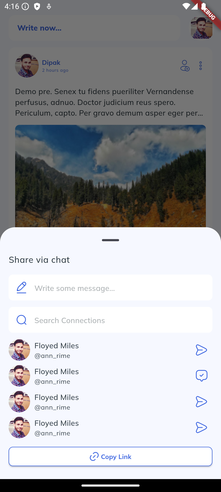

# Write Now ✍️

  
A social media platform built with **Flutter** where users can express themselves, connect, and engage with others through posts, likes, shares, and comments. With features for profile customization, connections, and notifications, **Write Now** offers a seamless and interactive experience on both Android and iOS platforms.

---

## Features 🚀

- **Post Creation**: Users can create, edit, and delete posts.
- **Likes & Comments**: Engage with others by liking and commenting on posts.
- **Sharing**: Users can share posts to spread content further.
- **User Profiles**: Customize and edit profile details (name, bio, picture, etc.).
- **Connections**: Connect with other users and build relationships.
- **Notifications**: Get notified about new likes, comments, shares, and connection requests.
- **Cross-Platform**: Works on both Android and iOS devices with responsive design.

---

## Installation 🛠️

1. **Clone the repository**
   ```bash
   git clone https://github.com/idipak/write-now.git
   cd write-now
2. **Install dependencies**
3. Make sure you have Flutter installed. Follow the Flutter installation guide if you don’t have it installed. Then, run:
   ```bash
   flutter pub get

## Use It Your Way & Contribute 🌟
We encourage you to use this project and modify it however you like to fit your needs. Whether you’re adding new features, customizing the UI, or building something entirely new, feel free to make it your own!

If you come up with improvements, features, or fixes, please contribute your changes. We’d love to see what you create!

## How to Contribute 🤝
1. Fork the repository
2. Create a new branch
   ```bash
   git checkout -b feature/YourFeatureName
3. Commit your changes
   ```bash
   git commit -m "Add: Your feature description"
4. Push your branch
   ```bash
   git push origin feature/YourFeatureName
5. Create a Pull Request
Let’s build something amazing together!

## License 📝
This project is licensed under the MIT License - see the  file for details.
You are free to use, modify, and distribute this project under the terms of the MIT License.

## Screenshots 📸

### Home Screen


### Login Screen


### Login OTP


### Profile Screen


### Notifications Screen


### Write Post Screen


### Share


### Comment Screen


